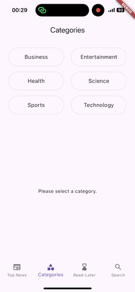
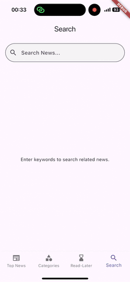

# News

A Flutter-based news reading application offering an intuitive interface and comprehensive reading experience. Users can browse trending news, filter by categories, save articles for later reading, and search for topics of interest.

## Main Features

### Top News

The homepage displays the latest and most popular news content, enabling users to quickly grasp important information. Each news article includes a title, brief description, and relevant image, presented in a card-style design for clear readability.

### News Categories

The application offers diverse news categories, including:

- Business
- Entertainment
- Health
- Science
- Sports
- Technology

Users can select specific categories based on their interests for quick access to relevant news content.

### Read-Later

- Save interesting articles to a reading list
- Save or remove articles using the hourglass icon in the top right corner of the article detail page
- View saved articles offline (external news links remain inaccessible without internet connection)

### Keyword Search

The search function allows users to quickly find news articles on specific topics or content. Search results are displayed in real-time and sorted by relevance.

## Upcoming Features

- News content sharing
- User-related features such as favorites, reading preferences, and browsing history
- Dark mode
- TBD....

## System Requirements

Supports modern versions of iOS and Android. For the best experience, we recommend keeping your system updated to the latest version.
